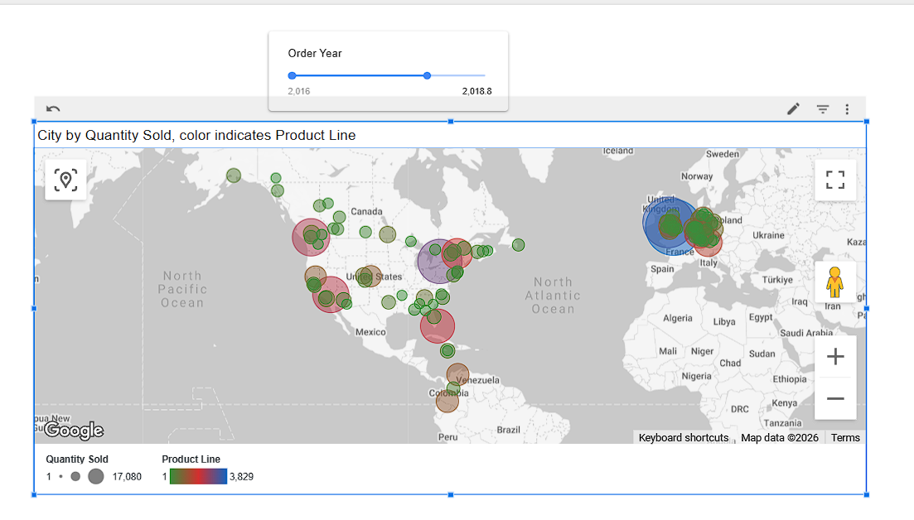
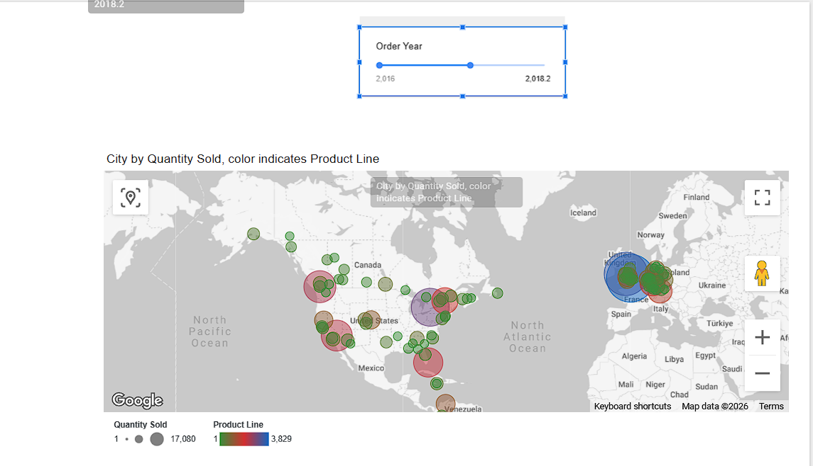
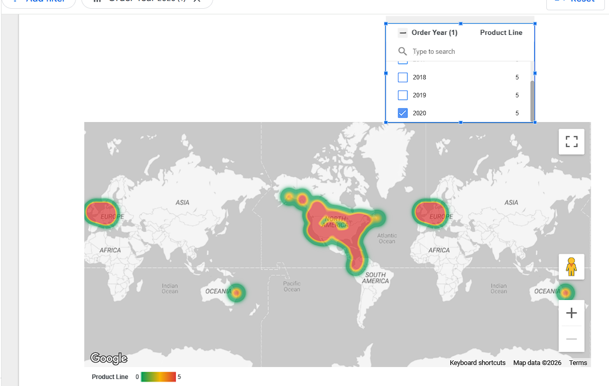
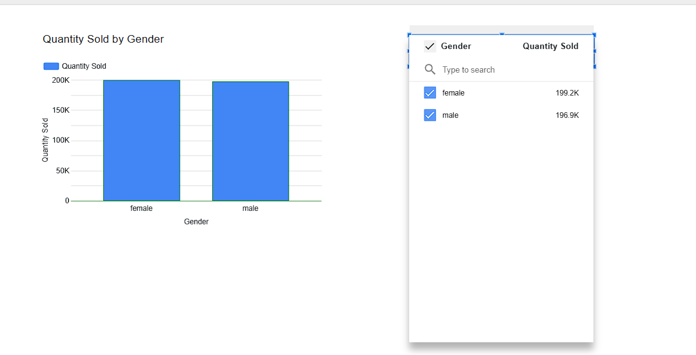
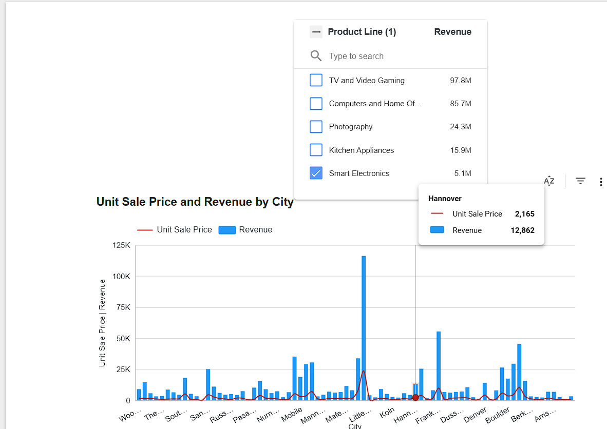
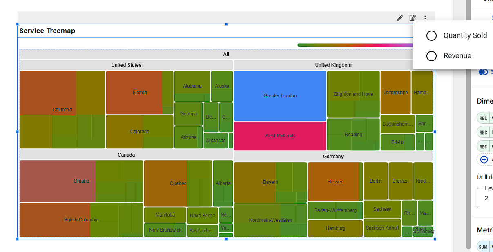

# 📊 Customer Loyalty & Sales Analytics Dashboard

## 📌 Project Overview

This project presents an interactive **Business Intelligence dashboard** built using **Google Looker Studio**. It analyzes customer behavior, product performance, and geographic sales distribution using real-world sample data.

The dashboard demonstrates how raw data can be transformed into **actionable insights** through:

* Data blending
* Interactive filtering
* Geospatial visualization

---

## 🎯 Business Objective

The goal is to help stakeholders answer:

* **Who** are the key customers?
* **What** products drive revenue?
* **Where** are sales concentrated?

---

## 📂 Dataset

* CustomerLoyaltyProgram.csv
* cust_loyalty_table.csv
* cust_table.csv

---

# 🧭 Dashboard Overview

The dashboard is structured into three key analytical areas:

### 1️⃣ Customer Insights

* Quantity Sold by Gender
* Interactive filters

### 2️⃣ Sales Performance

* Revenue vs Unit Price
* Product-level analysis

### 3️⃣ Geographic Analysis

* Bubble Map
* Heatmap

---

## 🌍 Dashboard Preview

---

## 📊 Key Visualizations

---

### 🌍 Sales Distribution Map by City (Interactive)

- Bubble size → Quantity Sold  
- Color → Product Line  
- Includes **Order Year slider**  
- Shows global sales distribution  

📌 Insight: Sales activity is heavily concentrated in North America and Western Europe, with key urban hubs driving the majority of transactions across multiple product lines.

---

### 🔥 Sales Intensity Heatmap by Region

- Color intensity represents **sales volume**
- Identifies regional hotspots

📌 Insight: High-density sales clusters are visible in major metropolitan areas, indicating strong urban demand patterns and potential market saturation in these regions.

---

### 🧱 Sales Intensity Heatmap by Product Line (Time-Filtered)

- Shows product performance across regions  
- Includes time filtering capability  

📌 Insight: Product demand varies significantly across regions and time periods, with certain product lines consistently dominating specific geographic markets.

---

### 📊 Customer Segmentation by Gender

- Compares quantity sold across gender  
- Includes dropdown filter  

📌 Insight: Sales distribution is highly balanced across genders, with female customers contributing slightly more purchases (199.2k vs 196.9k), indicating no significant gender bias in buying behavior.

### 📈 Revenue vs Unit Price by City

- Bars → Revenue  
- Line → Unit Sale Price  

📌 Insight: Several cities generate high revenue despite relatively lower unit prices, suggesting that sales volume—not pricing—is the primary driver of revenue performance in these markets.

### 🧱 Product Sales Hierarchy (Treemap)

- Hierarchical view: Country → State → City  
- Optional metric: Revenue  

📌 Insight: Sales are unevenly distributed across regions, with a few key states and cities contributing disproportionately to total revenue, highlighting opportunities for targeted market expansion.
---

## 🛠️ Tools & Technologies

- Google Looker Studio  
- Data Blending (Multiple datasets)  
- Interactive Filters & Controls  
- Geographic Visualizations  
- CSV Data (IBM Sample Dataset)  

---
## 📁 Project Structure

customer-sales-dashboard/
│
├── data/
│   ├── CustomerLoyaltyProgram.csv
│   ├── cust_loyalty_table.csv
│   └── cust_table.csv
│
├── screenshots/
│   ├── bubble_map_with_slicer.png
│   ├── heatmap_quantity_sold.png
│   ├── heatmap_productline.png
│   ├── quantity_by_gender.png
│   ├── dropdown_filter_gender.png
│   ├── revenue_vs_price_city.png
│   └── treemap_product_hierarchy.png
│
└── README.md

  🔍 Key Business Takeaways
  
- Urban regions dominate overall sales performance  
- Revenue growth is largely volume-driven rather than price-driven  
- Product line performance varies significantly by region  
- Customer purchasing behavior is evenly distributed across genders  
- High-performing regions present opportunities for deeper market penetration

  
## 🚀 Key Skills Demonstrated

- Data Visualization & Dashboard Design  
- Data Blending (Combining Multiple Data Sources)  
- Interactive Dashboard Development (Filters, Slicers, Controls)  
- Geospatial Analysis (Maps & Heatmaps)  
- Business Insight Generation & Storytelling  
- Data-Driven Decision Support

  ## 📌 Conclusion

This dashboard showcases the ability to translate raw transactional data into actionable business insights through effective visualization and interactivity. By integrating multiple data sources and applying geospatial and analytical techniques, the project provides a comprehensive view of sales performance, customer behavior, and regional trends.

The findings emphasize the importance of volume-driven revenue, regional sales concentration, and balanced customer participation, offering valuable direction for strategic decision-making and market expansion.
